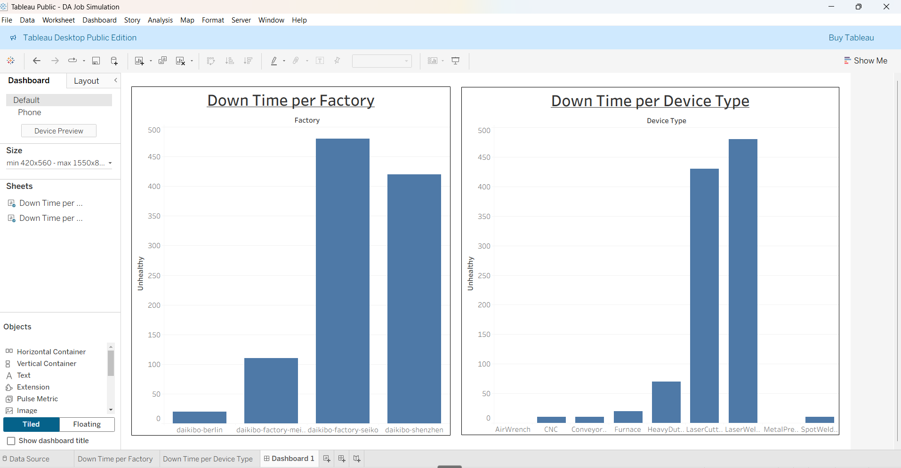
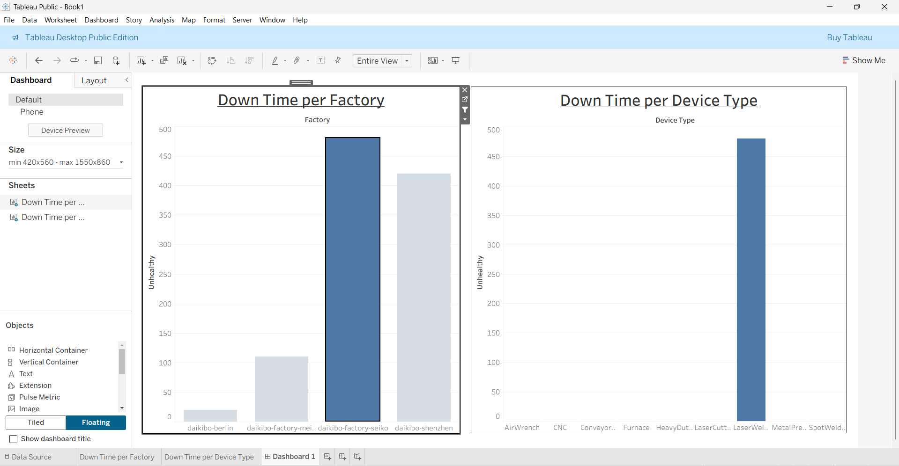

# Deloitte Data Analytics Virtual Experience (Forage)

## 📌 Project Overview
This project is based on the Deloitte Data Analytics Virtual Experience, where real-world business scenarios were simulated to perform data analysis and forensic investigation. The objective was to analyze machine telemetry data to identify downtime patterns and evaluate gender pay equality using structured data.

---

## 🛠️ Tools & Technologies
- Tableau  
- Microsoft Excel  

---

## 📊 Dashboard Preview

### 🔹 Downtime Analysis Dashboard

> Shows total downtime across factories highlighting the highest affected location.

### 🔹 Filtered View (Factory-Level Analysis)

> Shows total downtime across factories highlighting the highest affected location.

---

## 📊 Task 1: Data Analysis (Operational Efficiency)

### Objective
Analyze machine telemetry data across multiple factories to identify:
- Which factory experienced the highest machine downtime  
- Which machine types contributed most to failures  

### Approach
- Imported and structured JSON telemetry data in Tableau  
- Created a calculated field to measure downtime based on machine status  
- Built interactive dashboards to visualize:
  - Downtime per factory  
  - Downtime per device type  
- Applied filters to enable factory-level drill-down analysis  

### Outcome
- Identified the factory with the highest downtime  
- Determined the machine types responsible for the majority of failures  
- Enabled comparative analysis through interactive visualizations  

---

## ⚖️ Task 2: Forensic Analysis (Workforce Equality)

### Objective
Evaluate gender pay equality across job roles and factory locations using equality scores.

### Approach
- Processed compensation data in Excel  
- Applied conditional logic to classify equality scores into:
  - Fair  
  - Unfair  
  - Highly Discriminative  
- Structured the dataset for clear interpretation of fairness levels  

### Outcome
- Categorized compensation data to highlight potential inequality  
- Identified areas requiring further investigation  

---

## 🔍 Key Insights
- Certain factories exhibited significantly higher machine downtime  
- Specific device types contributed disproportionately to failures  
- Compensation data revealed varying levels of equality across roles and locations  

---

## 📁 Repository Contents
- Tableau Dashboard (.twb)  
- Dashboard Screenshots  
- Equality Analysis Excel File  

---

## 🚀 Learnings
- Applied data analysis techniques to real-world business scenarios  
- Developed interactive dashboards for operational insights  
- Strengthened skills in data cleaning, transformation, and interpretation  
- Gained exposure to forensic data analysis and business problem-solving  

---

## 📬 Note
This project is part of a virtual experience program and is intended for learning and demonstration purposes.
